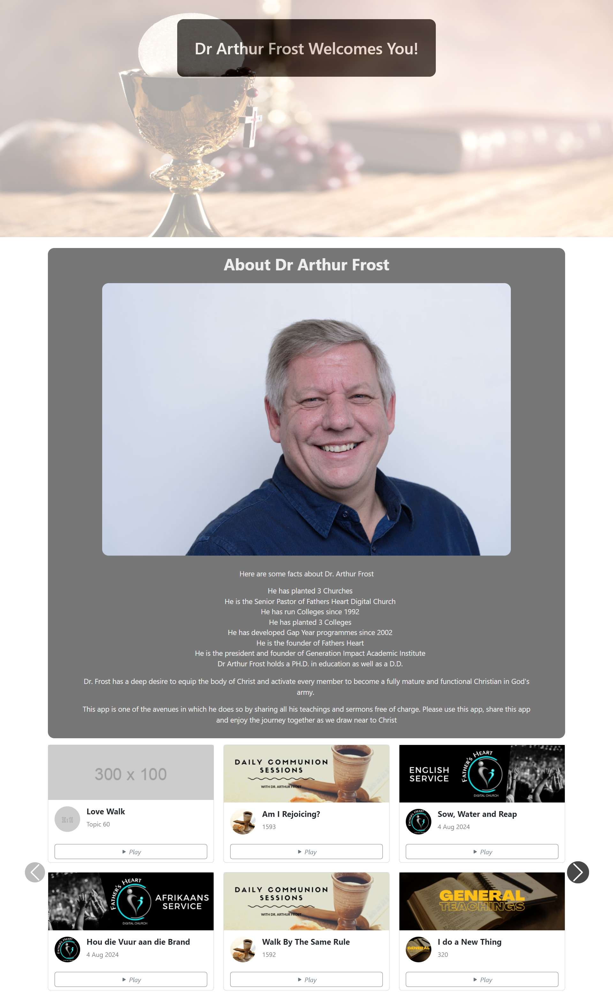

# Dr-Arthur-Frost React Application

## Overview
This React application fetches and displays timeline data from a remote JSON source. The data includes images, icons, audio files, and descriptive content. The application features a Bootstrap carousel for navigation, with audio playback functionality for each timeline entry.

## Features
- **Data Fetching:** Uses Axios to retrieve JSON data from a remote server.
- **Carousel:** Displays timeline items in a responsive Bootstrap carousel.
- **Audio Playback:** Allows users to play/pause audio associated with each timeline item.
- **Fallback Images:** Displays a placeholder image if the original image fails to load.
- **Time Display:** Shows the current time and total duration of the audio being played.
- **Responsive Design:** Optimized for various screen sizes using Bootstrap's grid system.

## Installation

### Prerequisites
- Node.js
- npm or yarn

### Steps

1. **Clone the repository:**
   ```bash
   git clone https://github.com/AshtinJW-Dev/Dr-Arthur-Frost.git

   ```
2. **Navigate to the project directory:**
   ```bash
   cd dr-arthur-frost
   ```

3. **Install dependencies:**
   ```bash
   npm install
   ```

4. **Start the development server:**
   ```bash
   npm start
   ```

## Usage
After starting the development server, open your browser and navigate to `http://localhost:3000` to view the application.

## Screenshots
